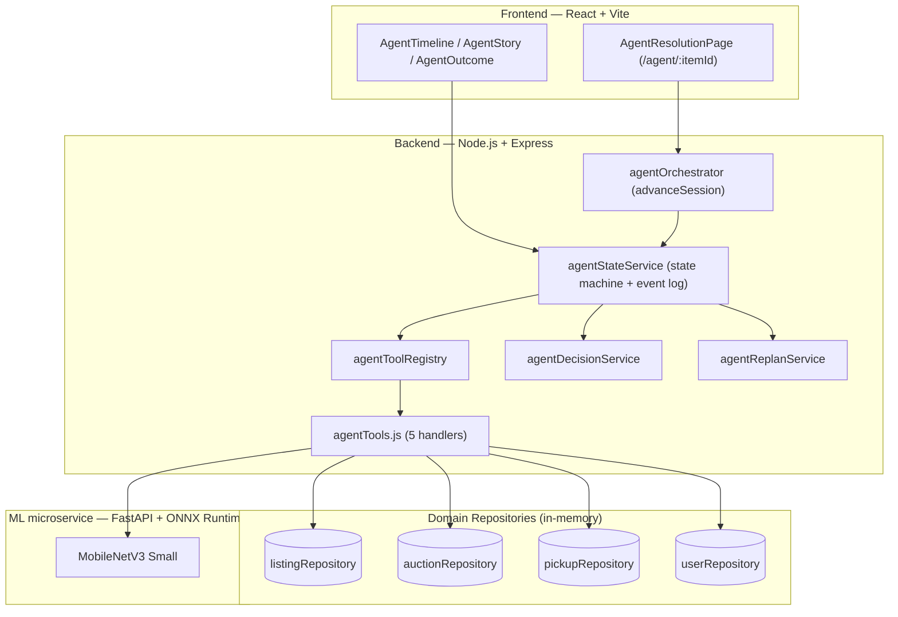
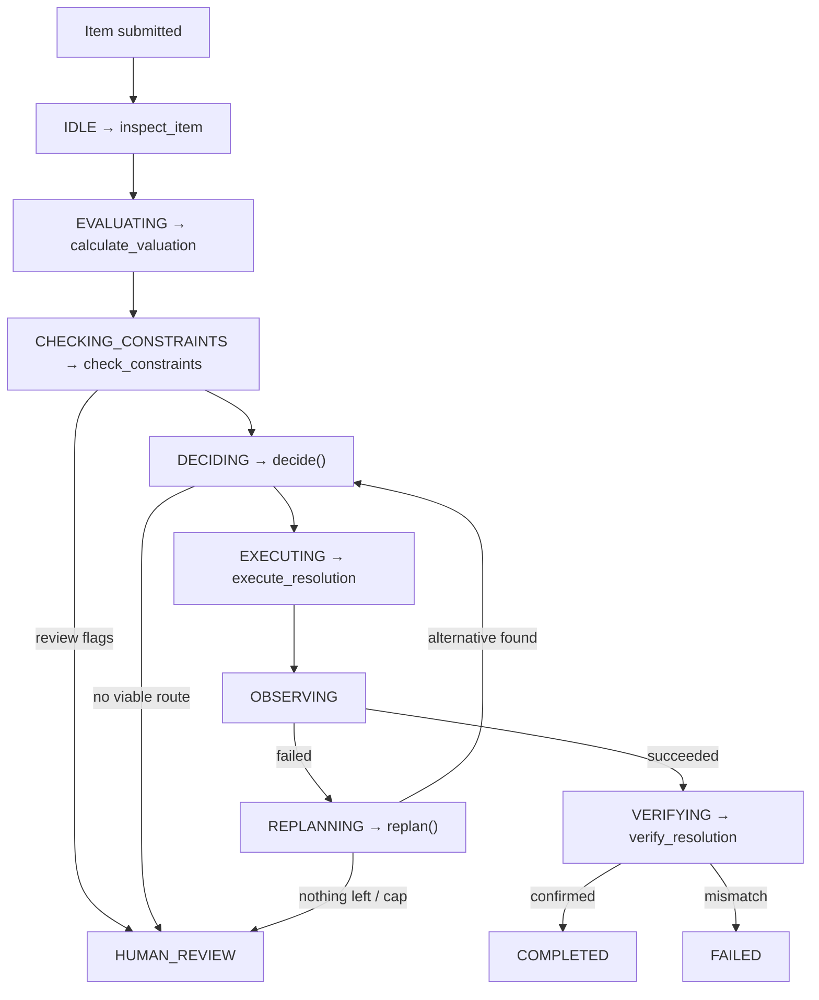

# ♻️ Punarchakra

**An AI-powered autonomous e-waste resolution agent.** It investigates a submitted device, chooses the highest-value valid outcome, executes the required backend action, independently verifies the resulting state, and replans on its own when the first plan fails.

USER UPLOAD DEVICE → UNDERSTAND → DECIDE → ACT → VERIFY → REPLAN

**Problem Statement 5 — Autonomous Customer Resolution Agent** · IIT Bhubaneswar Agentic AI Hackathon

**GitHub:** https://github.com/sakshamcreates/punarchakra-iit-bhubhneshwar
**Live Demo:** #https://punarchakra.netlify.app

---

## In 30 Seconds

```text
Device owner submits item
        ↓
Agent understands the goal
        ↓
Retrieves case + customer + valuation + constraints
        ↓
Selects an executable resolution
        ↓
Executes a real backend mutation
        ↓
Reads the resulting state
        ↓
   Did reality match the plan?
   ↓ YES              ↓ NO
COMPLETE            REPLAN → alternative → VERIFY → COMPLETE / ESCALATE
```

> **Punarchakra does not merely predict a resolution. It closes the loop between decision, execution, observation, verification, and adaptation.**

---

## Judge Proof

Everything below is implemented and demonstrable, not aspirational:

- ✅ Reads real case, customer, and valuation state before deciding anything
- ✅ Evaluates constraints and per-route eligibility before a route is even considered
- ✅ Selects an executable resolution from evidence — zero route-specific `if` branches
- ✅ Executes a real backend mutation (listing / auction / pickup)
- ✅ Detects execution failure from a structured tool result, not an exception
- ✅ Updates its available action space (excludes the failed route)
- ✅ Replans by re-running the **same** decision policy on the updated view
- ✅ Executes the alternative route
- ✅ Independently verifies the resulting state — sabotage-tested, doesn't trust the executor's own success flag
- ✅ Escalates to "human review" only when no safe route remains, with full context preserved

---

## What Makes This Autonomous

A judge's real question is: *is this a classifier with a UI, or is it actually an agent?* The distinction:

| A classifier / predictor | Punarchakra |
| Outputs a label or score | Selects an **executable action** from evidence |
| Stops after the prediction | **Executes** the action against real backend state |
| Never checks what happened | **Verifies** the resulting state independently |
| Has no notion of failure | **Observes** structured failure and **replans** around it |
| One-shot | **Closed-loop**: decide → act → observe → adapt → verify → complete/escalate |

Every session carries an explicit `goal` string and a 19-field case-state object (`agentStateService.createSession`) — not a chat transcript the system has to re-infer intent from.

---

## Where AI Fits

The decision and replanning logic in Punarchakra is **deterministic by design** — this section explains exactly where AI is, and why the rest isn't.

```text
AI/ML Perception → Structured Evidence → Autonomous Control Layer → Tool Execution → Verification → Replanning
```

| Stage | What it is | Nature |
|---|---|---|
| Device classification | MobileNetV3 Small via ONNX Runtime, in a FastAPI microservice | **AI/ML — probabilistic** |
| Classification confidence | Output of the model above | Evidence |
| Valuation | Expected-value estimate per candidate route | Decision evidence |
| Constraint check | Rule-based eligibility per route | Evidence (eligibility) |
| Route selection | `agentDecisionService.decide()` | **Deterministic controller** |
| `execute_resolution` | Backend mutation | **State-changing action** |
| `verify_resolution` | Independent state re-read | **Validation** |
| Replanning | Excludes failed route, reruns `decide()` | **Adaptive closed-loop behavior** |

> **AI produces evidence. The autonomous control layer turns that evidence into constrained, executable, verifiable actions.**

No LLM performs reasoning or route selection anywhere in this pipeline. That's intentional: for a system that mutates real listing, auction, and pickup state, a deterministic and fully auditable decision layer is a safer engineering choice than an opaque model choosing which mutation to fire. The full breakdown is in [AI/ML Layer](#aiml-layer); the limitation is stated again, plainly, in [Implementation Scope & Limitations](#implementation-scope--limitations).

---

## PS5 Requirement → Implementation

| PS5 Requirement | Punarchakra |
|---|---|
| Understand customer goal | Explicit session `goal` + structured case state |
| Retrieve customer / order / inventory / policy | `userRepository` join · listing (order) · repair-component availability (inventory) · `check_constraints` (policy) |
| Select resolution | Constraint-aware expected-value decision, zero hardcoded route branching |
| Execute action | Real listing mutation / auction creation / pickup creation |
| Verify state change | Independent repository re-read, sabotage-tested |
| Adapt when blocked | Observe failure → exclude route → replan → re-decide |
| Escalate only when necessary | `HUMAN_REVIEW`, only on real review flags or zero viable routes |

## E-Waste Domain Mapping

| Enterprise Concept | Punarchakra Domain |
|---|---|
| Customer | Device owner / seller |
| Order / Case | E-waste listing |
| Inventory | Repair-component availability |
| Policy | Resolution constraints / business rules |
| Resolution | Repair · resale (whole) · parts · auction · scrap pickup · donation |
| State-changing action | Listing mutation / auction creation / pickup creation |
| Verification | Independent backend state re-read |
| Escalation | `HUMAN_REVIEW` |

We mapped the same agentic control problem onto e-waste resolution rather than relabeling arbitrary fields: investigate the case, reason over constraints, execute a permitted action, verify the resulting state, adapt when the environment changes. Where the domain has no honest equivalent of an enterprise concept (a multi-SKU warehouse, for example), that's stated in [Implementation Scope & Limitations](#implementation-scope--limitations), not simulated.

---

## Agent State Machine

```text
IDLE → EVALUATING → CHECKING_CONSTRAINTS → DECIDING → EXECUTING → OBSERVING → VERIFYING → COMPLETED

EXECUTING → (failure) → OBSERVING → REPLANNING → DECIDING

CHECKING_CONSTRAINTS / DECIDING → (blocked / no viable route) → HUMAN_REVIEW
```

`agentOrchestrator.advanceSession()` is the single driver of every transition — there is no second code path that can move a session's status.

---

## Autonomous Resolution in Action

A real, reproducible scenario (`SCENARIO_FAILURE_REPLAN`, item `item-demo-001`, a damaged "Motherboard-X1" PCB), driven end-to-end via `backend/testphase12.js`.

**Goal:** *"Resolve damaged PCB through the highest-value verified route."*

**Evidence:** customer joined via `userRepository`; item classified `pcb`, confidence `83`; 6 candidate routes valued ₹0 (donate) to ₹12,000 (repair); all six pass constraints, but repair-component availability is `false`.

The decision policy runs on this evidence — and fails, then recovers. That full sequence is the centerpiece of this README:

## Failure → Replan: The Killer Scenario

```text
DECIDE     Repair selected — ₹12,000 expected value (highest among available routes)
   ↓
ACT        execute_resolution("repair") called
   ↓
RESULT     { success:false, errorCode:"REQUIRED_COMPONENT_UNAVAILABLE" }   ← real tool result, not a thrown exception
   ↓
OBSERVE    EXECUTING → OBSERVING (session does NOT go straight to FAILED)
   ↓
REPLAN     agentReplanService.replan() marks "repair" unavailable
   ↓
RE-DECIDE  The SAME decide() policy reruns on the updated route-availability view
   ↓
DECIDE     Parts selected — ₹1,599 expected value (next-highest available)
   ↓
ACT        execute_resolution("parts") mutates listing.sale_type → "parts"
   ↓
VERIFY     verify_resolution independently re-reads the listing, confirms sale_type === "parts"
   ↓
COMPLETED  decisionHistory: [repair, parts] · replanHistory: [repair excluded] · observations: [1 failure, 1 success]
```

> **There is no hardcoded "if repair fails, choose parts" branch.** The failed route is removed from the available action space, and the *same, unmodified* decision policy is re-run against the updated state. That's what makes "repair → parts" a genuine replan, not a scripted fallback — the [decision policy](#the-decision-policy) below has no route-specific logic to fall back through.

Full timeline is inspectable via `GET /api/agent/timeline/:sessionId`. Three more deterministic scenarios exercise other PS5 requirements — see [Demo Scenarios](#demo-scenarios).

---

## Workflow vs Agent

**Fixed workflow** — the next step is fixed by position in the script:
```text
A → B → C → D
If C fails → stop / escalate
```

**Punarchakra** — the next step is chosen from the state the previous step produced:
```text
A → B → C → D → observe result → update state → replan → execute alternative → verify → complete / escalate
```

The failed-execution path and the successful path lead to genuinely different runtime behavior, chosen dynamically — not two branches an author wrote out in advance. That's the actual content of "autonomous" here: **goal-directed control + state observation + dynamic action selection + verification + replanning**, not every stage being model-driven.

---

## The Decision Policy

Conceptually, for each candidate route still marked available:

```text
Expected Value(route) = estimated outcome value − applicable costs/penalties
```

`agentDecisionService.decide()` picks the highest expected-value route that `check_constraints` has not marked unavailable. The important property for autonomy isn't the formula — it's that **the controller evaluates whatever routes are currently available, with no route name ever hardcoded into a fallback chain.** When `replan()` removes a route from availability, `decide()` runs unmodified against the smaller set — the same function that made the first decision makes the second one.

---

## Tool Architecture

| Tool | Type | Purpose |
|---|---|---|
| `inspect_item` | READ | Classifies the device (ONNX/MobileNetV3), retrieves the customer |
| `calculate_valuation` | READ | Expected value for all six candidate routes |
| `check_constraints` | READ | Per-route eligibility, policy rules |
| `execute_resolution` | **ACT** | Mutates `listing` / creates `Auction` / creates `Pickup` |
| `verify_resolution` | **VERIFY** | Independent re-read confirming the mutation |

All five are registered through a generic `agentToolRegistry` (a pure name→handler map, zero domain logic); an unregistered tool throws `NOT_FOUND` rather than fabricating a result. **Only `execute_resolution` crosses the mutation boundary** — enforced by the state machine itself, since `EXECUTING` is the only status allowed to call a mutating handler.

---

## Verification

Tool-call success and resolution success are not the same claim:

```text
execute_resolution("parts") → { success: true }
        ↓
verify_resolution independently re-reads listingRepository.findById(itemId)
        ↓
Confirms: a resolution record exists · it matches the route just executed · listing.sale_type matches that route
        ↓
Only if ALL hold → session marked COMPLETED
```

This was **sabotage-tested**: `testphase12.js` Test E erases `listing.resolution` right after a successful execution, and `verify_resolution` still fails the check — proof that verification reads real state instead of trusting `execute_resolution`'s own return value.

---

## Escalation

`HUMAN_REVIEW` is reached only when `check_constraints` raises a real review flag, or `decide()` / `replan()` genuinely find zero viable routes — including after the hard `MAX_RESOLUTION_ATTEMPTS = 3` cap (`agentConstants.js`). On escalation, `finalResolution` stays unset and the full `decisionHistory` / `replanHistory` / `observations` trail is preserved, so a human picks up with context rather than a dead end. Every failed route is remembered, so it's never silently re-selected.

---

## Full System Architecture





Agent ↔ State ↔ Tools ↔ Verification is a closed loop: every stage reads and writes the same session object through `agentStateService`; no stage holds private state the others can't see.

---

## AI/ML Layer

**Perception (probabilistic):** MobileNetV3 Small, ONNX Runtime, image preprocessing, device/scrap classification, confidence score.

**Control (deterministic):** valuation, constraint evaluation, route availability, expected-value decision, execution, verification, replanning.

This separation is deliberate — it avoids letting an opaque generative model directly mutate business state. The decision and replan policies are auditable expected-value logic, not a language model choosing actions; for a system that mutates real order/financial state, that trade — full inspectability over a black-box chain of thought — is a design choice, not a gap.

---

## Demo Scenarios

The live app exposes the agent at **`/agent/:itemId`**; `AgentResolutionPage` repeatedly calls `advance()` and renders whatever the backend returns — the frontend computes nothing itself.

| Scenario | Item | Demonstrates |
|---|---|---|
| `SCENARIO_NORMAL_REPAIR` | Dell Latitude 7490 | Clean happy path — decide → execute → verify → complete |
| `SCENARIO_FAILURE_REPLAN` | Generic PCB | Full failure → replan → re-execute → verify loop ([above](#failure--replan-the-killer-scenario)) |
| `SCENARIO_CONSTRAINT_SWITCH` | Samsung Galaxy S20 | A route blocked by policy *before* decision-time, never offered |
| `SCENARIO_NO_VIABLE_ROUTE` | Swollen battery pack | Every route blocked → safe escalation, nothing fabricated |

`demoEnvironmentService` has no `Math.random` and no timing dependency — every outcome is deterministic and reproducible on demand, verified by an explicit randomness-free check (`isDemoDataRandomFree`).

**2-minute judge walkthrough:** Goal ("resolve this PCB") → Decision (repair) → Action (execute repair) → Intermediate result (component unavailable) → Adaptation (exclude route, re-decide) → Final outcome (parts, verified) → Audit trail (`AgentTimeline`, every transition/decision/observation/replan).

---

## Technical Stack

React + Vite (frontend) · Node.js + Express, controller/service/repository layers (backend) · Python FastAPI + ONNX Runtime, MobileNetV3 Small (ML microservice) · in-memory array-based repositories (persistence)

---

## Implementation Scope & Limitations

- Repair-component availability is a single signal scoped to seeded demo items — no general warehouse/SKU system exists.
- Policy is rule-based (`check_constraints`), not RAG — no vector store or document corpus.
- Decision/replan logic is deterministic expected-value logic, not LLM-driven, by design.
- Persistence is in-memory; a backend restart loses session/timeline/domain state.
- `repair` has no dedicated domain repository — it's a listing-status change, not a separate table.
- `retrieveCustomer` returns a real `userRepository`-joined record for signed-up sellers, and an explicitly labelled fallback (`source: "seller_id_only_no_registered_user_record"`) for seed listings with no account — never an invented name.
- The demo control surface isn't built for multiple judges driving concurrent sessions against the same in-memory state.
- No `HUMAN_REVIEW → DECIDING` resume endpoint yet — an escalated session ends the loop rather than accepting a human decision back into the state machine.

**Not claimed anywhere in this README:** production deployment at scale, real customers, revenue, accuracy/success-rate metrics, concurrent-user safety, or LLM-based reasoning in the decision/replan policies.

---

## Roadmap

General enterprise inventory/SKU system · richer policy retrieval · multi-judge-safe concurrent sessions · `HUMAN_REVIEW → DECIDING` resume endpoint · dedicated `repair` domain model · production-grade persistence.

---

## Implementation Verification

**Verified in code:** 5-tool registry + generic dispatch · state machine with `advanceSession()` as sole driver · deterministic, non-route-specific decision policy · real mutation on `execute_resolution` · sabotage-tested `verify_resolution` · observe→replan loop with `MAX_RESOLUTION_ATTEMPTS = 3` · real `userRepository` join with honest fallback · four deterministic demo scenarios · ONNX MobileNetV3 classifier.

**Simulated/scoped:** repair-component inventory (demo-only) · rule-based policy (no RAG) · in-memory persistence.

---

## Developer / Team

Saksham Singh 

## Links

- **GitHub:** https://github.com/sakshamcreates/punarchakra-iit-bhubhneshwar
- demo link:** #https://punarchakra.netlify.app/
